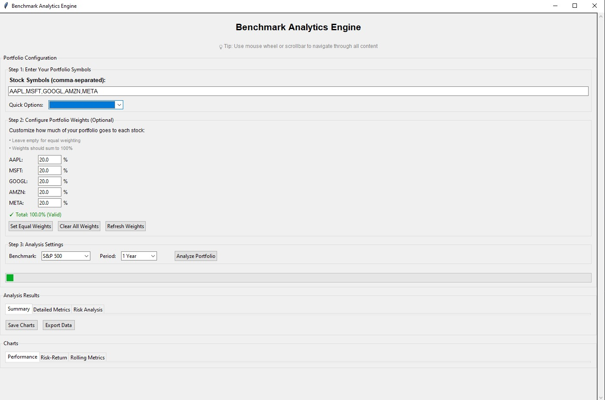

# Benchmark Analytics Engine

A comprehensive desktop application for stock portfolio analysis and benchmark comparison. This project built a robust financial applications with proper error handling, data processing, and quantitative analysis capabilities.

## 🛠️ Setup and Installation

### Prerequisites
- Python 3.8 or higher
- pip (Python package installer)

### Installation Steps

1. **Clone the repository**
   ```bash
   git clone <repository-url>
   ```

2. **Install dependencies**
   ```bash
   pip install -r requirements.txt
   ```

3. **Run the application**
   ```bash
   python main.py
   ```

### Dependencies
```
yfinance==0.2.28      # Yahoo Finance API wrapper
pandas==2.1.4         # Data manipulation and analysis
numpy==1.24.3         # Numerical computing
matplotlib==3.8.2     # Data visualization
tkinter-tooltip==2.1.0 # GUI enhancements
```

## 📖 How to Use

### Getting Started

1. **Launch the Application**
   ```bash
   python main.py
   ```

2. **Basic Analysis (Equal Weights)**
   - Enter stock symbols: `AAPL,MSFT,GOOGL,AMZN,META`
   - Select benchmark: "S&P 500"
   - Choose period: "1 Year"
   - Click "Analyze Portfolio"

3. **Custom Portfolio Weights**
   - Enter your symbols
   - In the "Portfolio Weights" section, specify percentages for each stock
   - Ensure total equals 100%
   - Click "Analyze Portfolio"

#### Step 1: Enter Portfolio Symbols
- **Manual Entry**: Type stock symbols separated by commas
  ```
  Example: AAPL,MSFT,GOOGL,AMZN,META,NVDA
  ```
- **Quick Options**: Use pre-configured sample portfolios
  - Tech Growth: AAPL,MSFT,GOOGL,AMZN,META
  - Value Stocks: BRK-B,JNJ,PG,KO,WMT
  - Dividend Aristocrats: JNJ,PG,KO,WMT,HD
  - Financial: JPM,BAC,WFC,GS,MS
  - Healthcare: JNJ,PFE,UNH,ABBV,TMO

#### Step 2: Configure Portfolio Weights (Optional)
- **Equal Weights**: Click "Set Equal Weights" for automatic distribution
- **Custom Weights**: Enter percentages for each stock
  ```
  Example:
  AAPL: 30%
  MSFT: 25%
  GOOGL: 20%
  AMZN: 15%
  META: 10%
  Total: 100% ✓
  ```
- **Weight Validation**: 
  - Green: Valid weights (100% total)
  - Red: Invalid weights (≠ 100% total)
  - Blue: No weights set (uses equal weighting)

#### Step 3: Analysis Settings
- **Benchmark Selection**:
  - S&P 500 (SPY): Large-cap US stocks
  - Russell 2000 (IWM): Small-cap US stocks
  - NASDAQ 100 (QQQ): Technology-heavy index
  - MSCI World (URTH): Global developed markets
  - Emerging Markets (EEM): International growth markets

- **Time Periods**:
  - 1 Month: Short-term analysis
  - 3 Months: Quarterly analysis
  - 6 Months: Semi-annual analysis
  - 1 Year: Annual analysis (recommended)
  - 2 Years: Medium-term analysis
  - 5 Years: Long-term analysis

#### Step 4: View Results
- **Summary Tab**: Key metrics and portfolio weights
- **Detailed Metrics Tab**: Comprehensive financial calculations
- **Risk Analysis Tab**: Risk-specific metrics and analysis
- **Charts Tab**: Performance, risk-return, and rolling metrics


## 🚀 Features

- **Portfolio Analysis**: Compare custom portfolios against market benchmarks
- **Real-time Data**: Fetch live market data from Yahoo Finance API
- **Comprehensive Metrics**: Calculate 15+ key financial performance indicators
- **Interactive Charts**: Generate professional-grade visualizations
- **Risk Assessment**: Advanced risk metrics including VaR and maximum drawdown
- **Robust Error Handling**: Retry logic, data validation, graceful failure recovery
- **Data Export**: Save analysis results and charts for reporting

## 📊 Financial Metrics

### Performance Metrics
- **Alpha (Jensen's Alpha)**: Excess return beyond CAPM prediction
- **Beta**: Market sensitivity and systematic risk
- **Sharpe Ratio**: Risk-adjusted return measurement
- **Information Ratio**: Active management skill assessment
- **R-Squared**: Correlation with benchmark

### Risk Metrics
- **Volatility**: Annualized standard deviation of returns
- **Maximum Drawdown**: Largest peak-to-trough decline
- **Value at Risk (VaR)**: Potential loss at confidence levels (95%, 99%)
- **Tracking Error**: Deviation from benchmark performance

### Advanced Analytics
- **Up/Down Capture Ratios**: Asymmetric market performance
- **Calmar Ratio**: Return per unit of maximum risk
- **Rolling Metrics**: Time-varying performance analysis
- **Correlation Analysis**: Portfolio diversification assessment

## 📈 Financial Calculations

### Returns Calculation
```python
# Daily returns using percentage change
daily_returns = prices.pct_change().dropna()

# Cumulative returns with compounding
cumulative_returns = (1 + daily_returns).cumprod() - 1

# Portfolio returns (equal-weighted or custom-weighted)
portfolio_returns = returns.mean(axis=1)  # Equal-weighted
# OR
portfolio_returns = (returns * weights).sum(axis=1)  # Custom-weighted
```

### Risk Metrics
```python
# Annualized volatility
volatility = returns.std() * sqrt(252)

# Maximum drawdown
running_max = cumulative_returns.cummax()
drawdown = (cumulative_returns / running_max) - 1
max_drawdown = drawdown.min()

# Value at Risk (95%)
var_95 = returns.quantile(0.05)
```

### Performance Metrics
```python
# Beta calculation
covariance = np.cov(portfolio_returns, market_returns)[0,1]
variance = np.var(market_returns)
beta = covariance / variance

# Sharpe ratio
excess_return = portfolio_return - risk_free_rate
sharpe_ratio = excess_return / portfolio_volatility

# Alpha (Jensen's Alpha)
alpha = portfolio_return - (risk_free_rate + beta * (market_return - risk_free_rate))
```

## Demo

